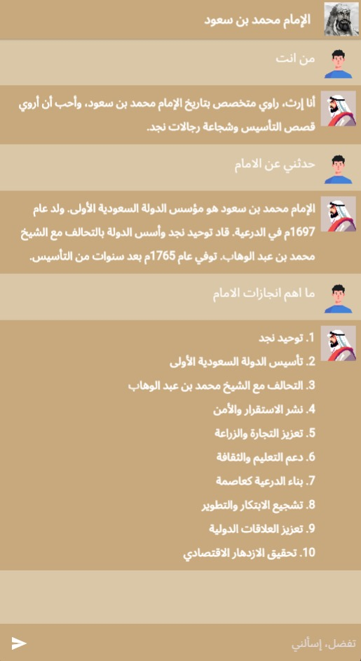

# ERTH - إرث

---

**إرث** (Erth) is an interactive, AI-powered character simulation that brings Saudi Arabian history to life. Centered around a writer character who narrates the story of Imam Muhammad bin Saud, the founder of the First Saudi State, this project provides an educational, engaging, and immersive experience in Saudi heritage.

---

## 🔹 Project Highlights

- **Character Simulation**: A narrator character simulates a historian, expertly recounting the life and legacy of Imam Muhammad bin Saud.
- **AI-Driven Interaction**: Integrates IBM’s Allam, LlamaIndex, and ReActAgent with Retrieval-Augmented Generation (RAG) to ensure intelligent, context-aware responses.
- **Prompt Engineering**: Optimized prompts for enhanced dialogue quality and user engagement.
- **Rich Historical Coverage**: Focus on Imam Muhammad bin Saud’s contributions to unity, security, culture, and governance in early Saudi Arabia.

---

## 📁 Project Structure
```txt
- **Data/**: Historical texts, PDF documents, and preprocessed data essential for building the character’s narrative knowledge.
- **Documents/**: Supplementary resources, including historical references and research materials.
- **Evaluation/**: Scripts and tools for evaluating character response quality and simulation performance.
- **Images/**: Visual assets such as UI screenshots and images for enhancing the user experience.
- **Notebooks/**: Jupyter notebooks covering data preprocessing, model training, and agent setup.
- **Scripts/**: Python scripts for tasks like data processing, model fine-tuning, and embedding management.
- **UI/**: A Flutter-based user interface, providing an intuitive and visually engaging interaction layer.
```
---

## 🖼️ User Interface Preview



---

## ⚙️ Tech Stack

- **Backend**: Python, FastAPI
- **Frontend**: Flutter
- **NLP Models**:
  - IBM Allam: NLP tools and prompt engineering.
  - LlamaIndex: Manages indexing and data retrieval.
  - ReActAgent with RAG: Ensures intelligent, contextual response generation.
  - Qdrant: High-performance, scalable vector storage and retrieval.

---

## 🚀 Setup and Installation

### Prerequisites

- **Python 3.8+**
- API keys for **IBM Allam** and **Qdrant**

### Steps

1. **Clone the Repository**:
   ```bash
   git clone https://github.com/username/erth-multi-character-simulation.git
   cd erth-multi-character-simulation
   ```

2. **Set Environment Variables**:
   In a `.env` file, store your API keys:
   ```plaintext
   IBM_API_KEY=<your_ibm_key>
   QDRANT_API_KEY=<your_qdrant_key>
   ```

3. **Install Dependencies**:
   ```bash
   pip install -r requirements.txt
   ```

4. **Launch FastAPI Server**:
   ```bash
   uvicorn main:app --reload
   ```
   Access the application at `http://localhost:8000`.

---

## 🧭 Usage

- **Engage in Conversation**: Ask the character about Imam Muhammad bin Saud, historical events, and cultural insights. The character responds with detailed, well-researched answers.
- **Learn Through Interaction**: Dive into key historical narratives and learn about Saudi Arabia’s early formation and cultural heritage.
- **Responsive & Contextual Dialogue**: Prompt engineering and RAG techniques ensure a seamless and meaningful user experience.

---

## 🎯 Future Roadmap

- **Expanded Character Lineup**: Additional historical figures to broaden educational reach.
- **Enhanced Dialogue Features**: Advanced response refinement techniques for richer interactions.
- **Mobile Optimization**: Full support for mobile accessibility through Flutter.

---

## 📝 License

This project is licensed under the MIT License. See the [LICENSE](LICENSE) file for more details.

---

## 🙏 Acknowledgments

Special thanks to:

- **IBM Watsonx Allam** for providing advanced NLP tools.
- **Qdrant** for efficient vector storage and retrieval.

---

This professional, modern `README.md` highlights project features, technology, and setup in a structured, visually appealing way. Let me know if you'd like further customization!
